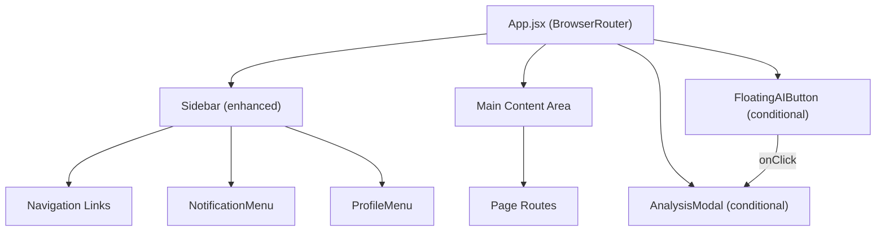
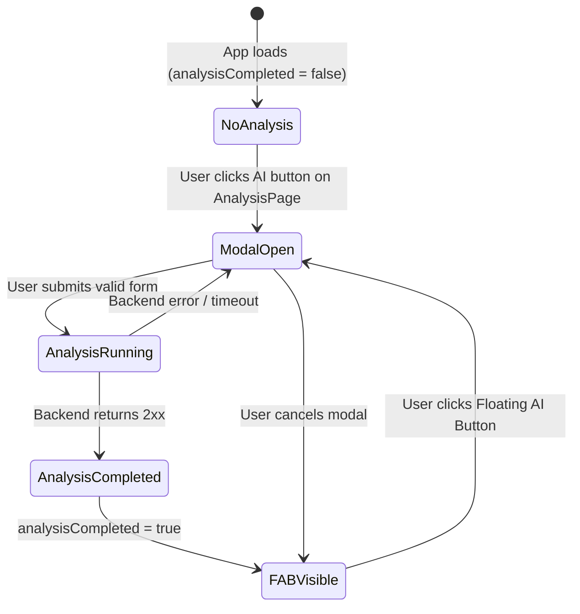

# Design Document: Layout Navigation Overhaul

## Overview

This design describes the architectural changes required to overhaul the SmartInvest application's layout and navigation system. The core changes are:

1. **Remove the global Header component** — Eliminate `Header.jsx` and its fixed-position wrapper from `App.jsx`, reclaiming vertical space for content.
2. **Consolidate controls into the Sidebar** — Move NotificationMenu and ProfileMenu into the Sidebar's bottom section, making it the single hub for navigation and user controls.
3. **Introduce a Floating AI Button** — A globally-rendered, fixed-position button (AI chip logo) that appears after the user's first successful analysis, enabling analysis from any page.
4. **Add an Analysis Modal** — A reusable modal overlay with the analysis configuration form (Method, Index, Period, Capital) that can be triggered from the Floating AI Button on any page.

The design preserves the existing Sidebar open/collapsed behavior and integrates new elements without disrupting the current navigation flow.

## Architecture

### High-Level Component Tree (After Overhaul)



### State Flow



### Key Architectural Decisions

| Decision | Rationale |
|----------|-----------|
| State lives in `App.jsx` | The `analysisCompleted` flag controls global rendering of the Floating AI Button; lifting state to App avoids prop-drilling through unrelated page components. |
| Single `AnalysisModal` instance at App level | Prevents re-mounting on navigation; the modal is rendered once and toggled via state. |
| Sidebar receives user/notification state via props or context | Keeps Sidebar a presentational component; auth state can be passed down from App or a future auth context. |
| No external state library | The feature scope is small enough for React `useState`; avoids adding Redux/Zustand overhead. |
| Reuse existing Tailwind CSS utility classes | Consistent with the project's styling approach (Tailwind v4 via `@tailwindcss/vite`). |

## Components and Interfaces

### 1. App.jsx (Modified)

```jsx
// State additions
const [analysisCompleted, setAnalysisCompleted] = useState(false);
const [isAnalysisModalOpen, setIsAnalysisModalOpen] = useState(false);

// Render changes:
// - Remove Header import and <Header /> element
// - Remove fixed-position header wrapper div
// - Change main padding from pt-24 to pt-8 (uniform padding)
// - Add <FloatingAIButton /> (conditional on analysisCompleted)
// - Add <AnalysisModal /> (conditional on isAnalysisModalOpen)
```

**Props passed down:**
- `Sidebar`: `isOpen`, `onToggle` (existing), plus `isLoggedIn`, `user` (new)
- `FloatingAIButton`: `onClick` → opens modal
- `AnalysisModal`: `isOpen`, `onClose`, `onAnalysisComplete`
- Pages (via context or props): `setAnalysisCompleted`, `setIsAnalysisModalOpen`

### 2. FloatingAIButton (New Component)

**Path:** `src/components/ui/FloatingAIButton.jsx`

```typescript
interface FloatingAIButtonProps {
  onClick: () => void;
}
```

**Behavior:**
- Fixed position: `top-right`, 20px from edges
- Displays AI chip SVG icon (reused from AnalysisPage)
- Minimum size: 44×44px (accessibility tap target)
- Box-shadow for floating effect
- Hover: scale(1.05) with 150ms transition
- z-index: 50 (above page content, below modals)

### 3. AnalysisModal (New Component)

**Path:** `src/components/features/analysis/AnalysisModal.jsx`

```typescript
interface AnalysisModalProps {
  isOpen: boolean;
  onClose: () => void;
  onAnalysisComplete: () => void;
}
```

**Behavior:**
- Centered overlay with `backdrop-blur-md` (4–8px blur)
- Fade-in animation (200–300ms)
- Form fields: Method (select), Target Index (select), Period (date range), Capital Allocation (numeric)
- Validation: all fields required, end date ≥ start date, capital 1–999,999,999,999
- On submit: show loading indicator, call backend, on success call `onAnalysisComplete()` and close
- On error: keep modal open, show error message, preserve form values
- Cancel/backdrop click: close without side effects
- 30-second timeout on backend request

### 4. Sidebar (Modified)

**Path:** `src/components/layout/Sidebar.jsx`

**New props:**
```typescript
interface SidebarProps {
  isOpen: boolean;
  onToggle: () => void;
  isLoggedIn: boolean;
  user: { name: string; avatar?: string } | null;
  onLoginClick: () => void;
}
```

**Structural changes:**
- Bottom section added with `NotificationMenu` and `ProfileMenu`
- Minimum 24px gap between nav links and bottom section (using `justify-between` flex + `gap-6`)
- In collapsed (Mini_Sidebar) mode: notification icon + profile avatar icon at bottom

### 5. ProfileMenu (Enhanced)

**Path:** `src/components/features/profile/ProfileMenu.jsx`

```typescript
interface ProfileMenuProps {
  isLoggedIn: boolean;
  user: { name: string; avatar?: string } | null;
  onLoginClick: () => void;
  isCollapsed: boolean;
}
```

**Behavior:**
- Logged in: shows avatar + name, click opens dropdown with profile actions
- Logged out: shows Login button (full sidebar) or user icon (collapsed)
- Dropdown rendered as overlay adjacent to the element

### 6. NotificationMenu (Enhanced)

**Path:** `src/components/features/notifications/NotificationMenu.jsx`

```typescript
interface NotificationMenuProps {
  isCollapsed: boolean;
}
```

**Behavior:**
- Bell icon button (existing)
- Click opens notification panel as dropdown/overlay adjacent to icon
- Works in both expanded and collapsed sidebar modes

## Data Models

### Application State (App.jsx)

```typescript
interface AppState {
  sidebarOpen: boolean;           // Existing - controls sidebar expand/collapse
  analysisCompleted: boolean;     // New - tracks if first analysis succeeded
  isAnalysisModalOpen: boolean;   // New - controls modal visibility
  isLoggedIn: boolean;            // Moved from Header - auth state
  user: UserInfo | null;          // New - user profile data
}

interface UserInfo {
  name: string;
  avatar?: string;  // URL or initials fallback
}
```

### Analysis Form Data

```typescript
interface AnalysisFormData {
  method: 'MVEP' | 'SIM' | 'CAF';
  targetIndex: 'LQ45' | 'IDX30' | 'JII';
  periodStart: string;  // ISO date string
  periodEnd: string;    // ISO date string
  capitalAllocation: number;  // in Rp, range [1, 999_999_999_999]
}

interface AnalysisFormValidation {
  isValid: boolean;
  errors: {
    method?: string;
    targetIndex?: string;
    periodStart?: string;
    periodEnd?: string;
    capitalAllocation?: string;
  };
}
```

### Analysis Modal State

```typescript
interface AnalysisModalState {
  formData: AnalysisFormData;
  isLoading: boolean;
  error: string | null;
}
```

## Correctness Properties

*A property is a characteristic or behavior that should hold true across all valid executions of a system — essentially, a formal statement about what the system should do. Properties serve as the bridge between human-readable specifications and machine-verifiable correctness guarantees.*

### Property 1: Error responses preserve analysis-completed flag

*For any* backend error response (4xx, 5xx, network error, or 30-second timeout), when the analysis request fails, the `analysisCompleted` flag SHALL remain at its previous value (unchanged).

**Validates: Requirements 3.5**

### Property 2: Invalid form data prevents submission

*For any* form state where at least one field is invalid (empty method, empty index, missing dates, end date before start date, or capital allocation outside the range [1, 999,999,999,999]), the `validateAnalysisForm` function SHALL return `isValid: false` with at least one error message, and the form SHALL NOT trigger a backend request.

**Validates: Requirements 4.3**

### Property 3: Valid form data triggers complete submission workflow

*For any* form state where all fields are valid (method selected, index selected, start date ≤ end date, capital in range [1, 999,999,999,999]), and the backend returns a successful response (HTTP 2xx), the system SHALL set `analysisCompleted` to true and close the modal.

**Validates: Requirements 3.4, 4.4**

## Error Handling

### Backend Request Errors

| Scenario | Behavior |
|----------|----------|
| HTTP 4xx/5xx response | Keep modal open, show error message, preserve form values, `analysisCompleted` unchanged |
| Network error (no response) | Same as above with "Network error" message |
| Request timeout (30s) | Abort request, same as above with "Request timed out" message |
| Invalid response body | Treat as error, same handling |

### Form Validation Errors

| Field | Validation Rule | Error Message |
|-------|----------------|---------------|
| Method | Must be selected (non-empty) | "Please select a method" |
| Target Index | Must be selected (non-empty) | "Please select a target index" |
| Period Start | Must be a valid date | "Please select a start date" |
| Period End | Must be a valid date AND ≥ start date | "End date must be on or after start date" |
| Capital Allocation | Must be numeric, 1 ≤ value ≤ 999,999,999,999 | "Capital must be between Rp 1 and Rp 999,999,999,999" |

### UI Error States

- **Modal error**: Displayed as a red banner/text within the modal, above the form buttons
- **Field-level errors**: Displayed as red text below each invalid field with a red border on the input
- **Loading state**: Disables form inputs and buttons, shows spinner in submit button

### Edge Cases

- User double-clicks submit: Disable button on first click (loading state prevents re-submission)
- User navigates away while modal is open: Modal stays open (route doesn't change while modal is active per Req 4.7)
- Browser refresh during analysis: Request is aborted, state resets to initial (analysisCompleted = false)

## Testing Strategy

### Unit Tests (Example-Based)

Unit tests cover specific scenarios, DOM structure assertions, and interaction flows:

1. **Header removal**: Assert App renders without Header component or fixed top bar
2. **Sidebar structure**: Assert NotificationMenu and ProfileMenu are in the bottom section with correct ordering
3. **Sidebar auth states**: Assert correct rendering for logged-in vs logged-out states
4. **Sidebar collapsed mode**: Assert mini sidebar shows notification + profile icons at bottom
5. **FloatingAIButton visibility**: Assert button is hidden when `analysisCompleted=false`, visible when `true`
6. **FloatingAIButton positioning**: Assert fixed position, top-right, min 44×44px, box-shadow, z-index
7. **FloatingAIButton hover**: Assert scale transform and transition classes
8. **AnalysisModal open/close**: Assert modal opens on FAB click, closes on cancel/backdrop
9. **AnalysisModal form fields**: Assert all required fields are present
10. **AnalysisModal backdrop blur**: Assert blur effect on backdrop
11. **AnalysisModal fade-in**: Assert animation classes
12. **Navigation persistence**: Assert FAB persists across route changes without re-mounting
13. **State reset on refresh**: Assert `analysisCompleted` initializes to false

### Property-Based Tests

Property-based tests verify universal correctness properties across many generated inputs. These use a PBT library (e.g., `fast-check`) with minimum 100 iterations per property.

| Property | What's Generated | What's Verified |
|----------|-----------------|-----------------|
| Property 1: Error responses preserve flag | Random error types (status codes 400-599, network errors, timeouts) | `analysisCompleted` flag unchanged |
| Property 2: Invalid form prevents submission | Random invalid form states (missing fields, bad dates, out-of-range capital) | `validateAnalysisForm` returns `isValid: false` with errors |
| Property 3: Valid form triggers workflow | Random valid form data (valid method, index, date range, capital in range) | `analysisCompleted` set to true, modal closes |

**PBT Library:** `fast-check` (JavaScript property-based testing library)

**Configuration:**
- Minimum 100 iterations per property test
- Each test tagged with: `Feature: layout-navigation-overhaul, Property {N}: {description}`

### Integration Tests

- Full flow: Open modal → fill form → submit → mock backend success → verify flag set + modal closed + navigation
- Full flow: Open modal → fill form → submit → mock backend failure → verify modal stays open with values

### Test File Structure

```
src/
├── components/
│   ├── ui/
│   │   └── FloatingAIButton.test.jsx
│   ├── features/
│   │   └── analysis/
│   │       └── AnalysisModal.test.jsx
│   └── layout/
│       └── Sidebar.test.jsx
├── utils/
│   └── validateAnalysisForm.test.js   ← Property tests live here
└── App.test.jsx
```

