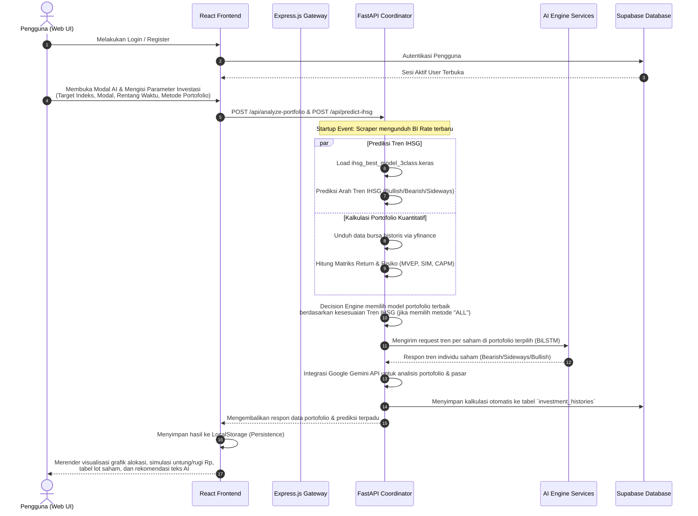

# 📈 SmartInvest-App

<div align="left">
  
  
  
  
  
  
</div>

SmartInvest adalah platform asisten keuangan pintar dan optimasi portofolio saham berbasis kecerdasan buatan (AI) dan teori keuangan modern. Aplikasi ini dirancang untuk membantu para investor ritel maupun institusi dalam mengambil keputusan investasi yang terarah di Bursa Efek Indonesia (khususnya untuk konstituen indeks **LQ45** dan **IDX30**). 

Dengan mengombinasikan **Analisis Kuantitatif Keuangan** (Modern Portfolio Theory, Single Index Model, CAPM), **Deep Learning** (BiLSTM + Attention) untuk prediksi tren pasar IHSG, serta **Generative AI** (Google Gemini) untuk memberikan interpretasi rekomendasi yang mudah dipahami, SmartInvest menjembatani analisis data yang kompleks menjadi keputusan investasi praktis.

---

## 🗺️ Daftar Isi
- [📌 Fitur Utama Platform](#-fitur-utama-platform)
- [🔄 Workflow Aplikasi Web (Fullstack)](#-workflow-aplikasi-web-fullstack)
- [👥 Penjelasan Pekerjaan per Role](#-penjelasan-pekerjaan-per-role)
  - [1. Data Science (DS)](#1-data-science-ds)
  - [2. AI Engineer (AI)](#2-ai-engineer-ai)
  - [3. Fullstack Developer (FS)](#3-fullstack-developer-fs)
- [📥 Tautan Unduhan Model ML](#-tautan-unduhan-model-ml-machine-learning-models)
- [📊 Sumber Dataset (Dataset Source)](#-sumber-dataset-dataset-source)
- [🛠️ Langkah-Langkah Replikasi & Setup Sistem](#%EF%B8%8F-langkah-langkah-replikasi--setup-sistem)

- [💡 Justifikasi Teknis (Mengapa Memilih Implementasi Tersebut?)](#-justifikasi-teknis-mengapa-memilih-implementasi-tersebut)
- [📖 Glosarium / Kamus Data (Data Dictionary)](#-glosarium--kamus-data-data-dictionary)

---

## 📌 Fitur Utama Platform

1. **AI Market Trend Forecasting**: Mengklasifikasikan tren arah IHSG (Bullish, Bearish, Sideways) menggunakan model Deep Learning BiLSTM + Attention berdasarkan 15 hari perdagangan terakhir dan 11 fitur indikator teknikal.
2. **Dynamic Portfolio Optimization**: Menyediakan 3 metode optimasi portofolio:
   - **MVEP (Mean-Variance Efficient Portfolio)**: Memaksimalkan Sharpe Ratio berdasarkan trade-off antara return historis dan kovarians risiko (teori Markowitz).
   - **SIM (Single Index Model)**: Menyederhanakan analisis kovarians dengan menghubungkan return saham terhadap rata-rata pasar untuk meminimalkan risiko residu.
   - **CAPM (Capital Asset Pricing Model)**: Alokasi bobot saham yang sensitif terhadap pergerakan pasar (Beta) untuk menciptakan portofolio defensif atau agresif.
3. **Decision Engine & Adaptive Selection**: Merekomendasikan metode portofolio terbaik secara otomatis berdasarkan kondisi tren pasar IHSG saat ini:
   - **Pasar Bullish** $\rightarrow$ Merekomendasikan metode dengan Sharpe Ratio tertinggi (SIM/MVEP).
   - **Pasar Bearish** $\rightarrow$ Merekomendasikan metode dengan risiko terkecil (CAPM).
   - **Pasar Sideways** $\rightarrow$ Merekomendasikan kombinasi hybrid (60% Sharpe Ratio & 40% Risk).
4. **Interactive Asset Allocation & Lot Sizing**: Menyajikan komposisi saham optimal dalam bentuk grafik lingkaran (Pie Chart), lengkap dengan kalkulasi jumlah lembar saham dan estimasi lot pembelian berdasarkan harga pasar riil terbaru (1 lot = 100 lembar) dan nominal modal investasi pengguna.
5. **AI Portfolio Interpretation**: Menghasilkan penjelasan naratif dan analisis risiko-keuntungan personal dalam Bahasa Indonesia menggunakan Google Gemini API.
6. **Autosave & History Management**: Menyimpan riwayat kalkulasi portofolio secara otomatis ke database Supabase (maksimal 20 riwayat per pengguna dengan mekanisme *First-In-First-Out* untuk menjaga efisiensi database).

---

## 🔄 Workflow Aplikasi Web (Fullstack)

Berikut adalah diagram alir dan penjelasan alur kerja saat seorang pengguna berinteraksi dengan aplikasi SmartInvest:



### Detil Langkah Workflow:
1. **Autentikasi Pengguna**: Pengguna mendaftar atau masuk melalui halaman Login/Register yang memproses token sesi aman melalui Supabase Auth.
2. **Inisialisasi Dasbor**: Suku bunga acuan Bank Indonesia (BI Rate) diperbarui secara otomatis di latar belakang dengan teknik scraping pada saat server FastAPI dinyalakan pertama kali (*Startup Event*).
3. **Pengisian Parameter AI**: Melalui `AnalysisModal`, pengguna menentukan batas nominal modal investasi (minimal Rp100.000), target indeks (LQ45/IDX30), rentang waktu data historis (6 bulan s/d 5 tahun), serta model portofolio pilihan.
4. **Pemrosesan Terpadu**:
   - Sistem FastAPI mengunduh data bursa historis secara berkala untuk emiten konstituen.
   - Model klasifikasi IHSG memprediksi sentimen pasar (Bullish, Bearish, atau Sideways) beserta tingkat kepercayaannya (*confidence score*).
   - Mesin kalkulator kuantitatif menghitung pembobotan optimal untuk ketiga metode alokasi portofolio.
   - Tren individu untuk saham-saham terpilih diprediksi menggunakan model BiLSTM internal agar pengguna tahu prospek jangka pendek masing-masing emiten.
5. **AI Interpretation**: Parameter numerik portofolio dikirim ke asisten aseli Google Gemini untuk diformulasikan menjadi ringkasan rekomendasi berbahasa Indonesia yang mudah dipahami.
6. **Penyimpanan Riwayat & Batasan**: Hasil kalkulasi lengkap dikirim ke Supabase Database secara otomatis. Sistem secara dinamis memeriksa batas maksimum penyimpanan (maksimal 20 riwayat) per akun pengguna. Jika melebihi batas, riwayat terlama akan dihapus.
7. **Penyajian Data (Presentation)**: Frontend React menerima data terstruktur dan menampilkannya dalam diagram interaktif (alokasi bobot saham), pengukur prediksi tren IHSG, simulasi proyeksi modal keuntungan/kerugian (Rupiah), jumlah pembelian lot, dan ringkasan teks dari asisten AI.

---

## 👥 Penjelasan Pekerjaan per Role

Proyek SmartInvest ini dikembangkan secara kolaboratif melalui tiga divisi utama: **Data Science (DS)**, **AI Engineer (AI)**, dan **Fullstack Developer (FS)**. Berikut adalah rincian peran dan kontribusi masing-masing divisi:

### 1. Data Science (DS)
Tim Data Science bertanggung jawab atas riset fundamental keuangan, eksplorasi data historis, implementasi rumus portofolio investasi, serta pembuatan visualisasi interaktif awal.
* **Tugas Utama**:
  - Melakukan *Exploratory Data Analysis* (EDA) terhadap return harian saham LQ45 dan IDX30 dari tahun 2021 hingga 2026.
  - Memformulasikan algoritma optimasi portofolio kuantitatif seperti MVEP menggunakan metode *Sequential Least Squares Programming* (SLSQP) dari SciPy, Single Index Model (SIM), dan CAPM.
  - Mengembangkan visualisasi korelasi saham (Correlation Heatmap), perbandingan risiko vs keuntungan (Risk vs Return Scatter Plot), serta volatilitas bergerak (Rolling Volatility).
  - Membangun prototipe asisten investasi interaktif menggunakan Streamlit untuk memvalidasi algoritma kuantitatif sebelum diintegrasikan ke sistem produksi.
* **Berkas Kunci**:
  - `data-science/notebook/notebook.ipynb`: Eksplorasi data awal, riset optimasi portofolio, dan perhitungan matematis.
  - `data-science/dashboard/dashboard.py`: Dasbor Streamlit untuk analisis data interaktif dan pengujian fungsionalitas visual.
* **Teknologi**: Python, Streamlit, Pandas, NumPy, Plotly, SciPy, PyPortfolioOpt, Scikit-Learn.

### 2. AI Engineer (AI)
Tim AI Engineer bertanggung jawab dalam melatih model Deep Learning untuk klasifikasi tren pasar, mengoptimalkan proses inference, dan mendeploy model ke dalam bentuk *microservices* mandiri berkinerja tinggi.
* **Tugas Utama**:
  - Merancang arsitektur Deep Learning **BiLSTM (Bidirectional Long Short-Term Memory) + Attention Mechanism** dengan kustomisasi layer (`CustomDenseMaju`) untuk mengklasifikasikan tren indeks dan harga saham.
  - Mengekstraksi 11 fitur indikator teknikal penting (seperti RSI, MACD, Moving Average Gap, Bollinger Bands Width, Rate of Change (ROC5), Volatility, Volume Log, dll.) dengan input sekuensial sepanjang 15 *time steps*.
  - Melatih model IHSG dan model emiten saham secara mendalam dan melakukan tuning hyperparameter untuk meminimalkan *overfitting*.
  - Membuat API mikro berbasis FastAPI untuk menyajikan prediksi arah tren saham secara real-time.
  - Mengimplementasikan *session spoofing* (header browser Chrome asli) pada scraper `yfinance` guna memintas pemblokiran *firewall* dan *rate limiting* dari Yahoo Finance.
* **Berkas Kunci**:
  - `ai-engineer/Model_Rekomendasi/KLASIFIKASI_IHSG_TUNED_DAN_REKOMENDASI.ipynb`: Pelatihan dan tuning model prediksi IHSG.
  - `ai-engineer/Model_Analisis/Modelling_trenSaham_FIXED_STABIL.ipynb`: Pelatihan model klasifikasi pergerakan tren emiten individual.
  - `ai-engineer/FastAPI_Rekomendasi_Services/main.py`: Layanan API prediksi IHSG dan alokasi model portofolio.
  - `ai-engineer/FastAPI_TrenSaham_Services/main.py`: Layanan API klasifikasi tren saham dengan teknik anti rate-limit.
* **Teknologi**: Python, TensorFlow / Keras, FastAPI, Uvicorn, Joblib, Scikit-Learn, yfinance.

### 3. Fullstack Developer (FS)
Tim Fullstack Developer bertanggung jawab atas arsitektur sistem produksi, manajemen basis data, autentikasi pengguna, orkestrasi API, serta pengembangan antarmuka web (UI/UX) premium yang responsif.
* **Tugas Utama**:
  - **Frontend**: Membangun antarmuka web interaktif menggunakan React.js dan TailwindCSS dengan desain modern (dark mode, glassmorphism, dan transisi halus). Mengembangkan fitur charting visualisasi bobot portofolio serta panel konfigurasi parameter investasi.
  - **Backend (Node.js Gateway)**: Menyediakan REST API menggunakan Express.js terhubung dengan basis data Supabase untuk menangani operasi CRUD riwayat portofolio pengguna (`investment_histories`).
  - **Backend (FastAPI Engine - SmartfastApi)**: Mengembangkan API utama Python yang mengoordinasikan input pengguna dari web React, melakukan scraping suku bunga BI Rate terbaru dari situs resmi Bank Indonesia, memuat berkas model AI lokal (`.keras`), menghitung bobot portofolio (MVEP, SIM, CAPM) berdasarkan parameter dinamis, mengintegrasikan Google Gemini API untuk ulasan naratif AI, serta menyimpan hasil akhir kalkulasi ke tabel `investment_histories` Supabase secara otomatis.
* **Berkas Kunci**:
  - `fullstack/frontend/src/`: Aplikasi React (Vite) yang berisi halaman utama (`AnalysisPage`, `RecommendationPage`, `HistoryPage`, `MethodPage`, `LandingPage`, dll.).
  - `fullstack/backend/index.js`: Node.js Express Gateway.
  - `fullstack/backend/SmartfastApi/main.py`: Server API koordinasi logika bisnis, AI/ML inference, scraping, dan Supabase client.
* **Teknologi**: React.js (Vite), TailwindCSS, Node.js (Express), FastAPI, Supabase (Postgres & Auth), Axios, Chart.js, Google Gemini Pro.

---

## 📥 Tautan Unduhan Model ML (Machine Learning Models)

Untuk menjalankan proyek ini secara lokal, Anda perlu mengunduh file model AI (`.keras` / `.keras.zip`) dan scaler (`.pkl`) yang telah dilatih. Seluruh berkas tersebut dapat diunduh melalui tautan Google Drive resmi berikut:

🔗 **[Tautan Unduh Model ML SmartInvest (Google Drive)](https://drive.google.com/drive/folders/1oXqPDtMdRE9wtlaAllRmGW3FCEs61G1L?usp=sharing)**

### 📁 Struktur Penempatan Berkas Model:
Setelah mengunduh berkas dari folder Google Drive di atas, Anda wajib meletakkannya di direktori berikut agar sistem dapat mendeteksi dan memuat (*load*) model dengan benar:

1. **Model Klasifikasi IHSG (Recommendation Service)**:
   * **Sumber Unduhan**: Folder `recommendation` di Google Drive.
   * **Berkas**: `ihsg_best_model_3class.keras` dan `ihsg_scaler_global.pkl`
   * **Tujuan**: Letakkan di folder `fullstack/backend/SmartfastApi/models/` (untuk model) dan `fullstack/backend/SmartfastApi/assets/` (untuk scaler).
   
2. **Model Klasifikasi Tren Emiten Saham (Analysis Service)**:
   * **Sumber Unduhan**: Folder `analysis` di Google Drive.
   * **Berkas**: `smartinvest_best_model_3class.keras.zip` dan `smartinvest_scaler_global.pkl`
   * **Tujuan**: Letakkan di folder `ai-engineer/FastAPI_TrenSaham_Services/` (untuk model zip dan scaler). *Catatan: Jika ingin menjalankan file `main.py` di direktori utama (root), salin berkas ini juga ke root direktori proyek.*

---

## 📊 Sumber Dataset (Dataset Source)

Aplikasi SmartInvest menggunakan data pasar saham historis dan real-time yang ditarik secara dinamis dari penyedia data keuangan global. Berikut adalah detail sumber data yang digunakan:

1. **API Utama (Dynamic Ingestion)**:
   * **Penyedia**: Yahoo Finance API (melalui pustaka Python [yfinance](https://github.com/ranaroussi/yfinance))
   * **Tautan Sumber Data**: 🔗 **[Yahoo Finance Official Website](https://finance.yahoo.com)**
   * **Akses**: Data ditarik secara real-time berdasarkan kode ticker emiten BEI (Bursa Efek Indonesia) dengan akhiran `.JK` (contoh: `BBCA.JK`, `TLKM.JK`) dan indeks pasar IHSG (`^JKSE`).
   
2. **Dataset Lokal Cadangan (Offline Fallback)**:
   * **Berkas**: `market_price_ihsg.csv` (berisi data historis indeks IHSG dari tahun 2021 hingga 2026).
   * **Tujuan**: Digunakan sebagai data dasar jika terjadi kendala jaringan ketika memuat histori IHSG.
   * **Lokasi Berkas**: `fullstack/backend/SmartfastApi/data/market_price_ihsg.csv`

---

## 🛠️ Langkah-Langkah Replikasi & Setup Sistem

<details>
<summary><b>🛠️ Klik untuk Membuka/Menutup Panduan Setup & Jalankan Lokal</b></summary>

Ikuti panduan berikut untuk mereplikasi dan menjalankan seluruh ekosistem SmartInvest di lingkungan lokal Anda.

### 📋 Prasyarat Umum
* **Python 3.9 s/d 3.11** (Sangat direkomendasikan Python 3.10)
* **Node.js LTS** (v18 atau lebih baru)
* Akun **Supabase** aktif (untuk database dan sistem autentikasi)
* API Key dari **Google AI Studio** (untuk asisten Gemini)

---


### 1. Setup Database & Auth (Supabase)
> **Catatan:**  
> Pada pengembangan SmartInvest, project Supabase menggunakan nama **`smartinvest-db`**. Namun pengguna bebas memakai nama project/database apa pun selama URL dan API key pada file `.env` telah disesuaikan.
1. Buat proyek baru di [Supabase Console](https://database.new).
2. Di bagian **SQL Editor**, jalankan perintah berikut untuk membuat tabel riwayat investasi:
   ```sql
-- ==========================
-- PROFILES TABLE
-- ==========================
CREATE TABLE profiles (
    id UUID PRIMARY KEY REFERENCES auth.users(id) ON DELETE CASCADE,
    full_name TEXT,
    avatar_url TEXT,
    created_at TIMESTAMPTZ DEFAULT now(),
    updated_at TIMESTAMPTZ DEFAULT now()
);

-- ==========================
-- INVESTMENT HISTORIES TABLE
-- ==========================
CREATE TABLE investment_histories (
    id UUID DEFAULT gen_random_uuid() PRIMARY KEY,
    user_id UUID REFERENCES auth.users(id) ON DELETE CASCADE,
    target_index TEXT NOT NULL,
    method TEXT NOT NULL,
    capital NUMERIC NOT NULL,
    expected_return NUMERIC,
    risk NUMERIC,
    bi_rate NUMERIC,
    sharpe_ratio NUMERIC,
    market_sentiment TEXT,
    portfolio_allocation JSONB,
    ai_interpretation TEXT,
    start_date DATE,
    end_date DATE,
    analysis_form JSONB,
    analysis_result JSONB,
    created_at TIMESTAMPTZ DEFAULT now()
);

-- ==========================
-- BI RATE TABLE
-- ==========================
CREATE TABLE bi_rates (
    tanggal DATE PRIMARY KEY,
    rate NUMERIC,
    created_at TIMESTAMPTZ DEFAULT now()
);

-- ==========================
-- SYSTEM LOGS TABLE
-- ==========================
CREATE TABLE system_logs (
    key TEXT PRIMARY KEY,
    value TEXT,
    updated_at TIMESTAMP DEFAULT now()
);
```

   ```
3. Aktifkan fitur **Email Auth** atau penyedia autentikasi lain di tab **Authentication** $\rightarrow$ **Providers**.

---

### 2. Setup dan Menjalankan Data Science Dashboard (Streamlit)
Dasbor ini digunakan secara independen untuk melakukan eksplorasi data.
```bash
# Pindah ke direktori data-science
cd data-science

# Buat virtual environment
python -m venv .venv

# Aktifkan virtual environment (Windows)
.venv\Scripts\activate

# Instalasi dependensi
pip install -r requirements.txt

# Jalankan dashboard Streamlit
cd dashboard
streamlit run dashboard.py
```
*Aplikasi visualisasi data science akan dapat diakses di browser pada alamat http://localhost:8501*

---

### 3. Setup dan Menjalankan AI Engineer Microservices (FastAPI)
Jika ingin mengaktifkan layanan prediksi tren saham individual di luar portal fullstack utama:
```bash
# Pindah ke direktori ai-engineer
cd ai-engineer/FastAPI_TrenSaham_Services

# Buat virtual environment
python -m venv .venv

# Aktifkan virtual environment (Windows)
.venv\Scripts\activate

# Instalasi dependensi
pip install -r requirements.txt

# Jalankan API lokal
python main.py
```
*Layanan API AI Engineer berjalan di alamat http://127.0.0.1:8000 dengan dokumentasi Swagger interaktif di http://127.0.0.1:8000/docs*

---

### 4. Setup dan Menjalankan Fullstack Backend

#### A. FastAPI Engine (SmartfastApi)
FastAPI bertindak sebagai mesin kalkulator model AI dan perantara Gemini.
1. Salurkan berkas model `.keras` dan berkas `.pkl` jika belum ada di tempatnya:
   - Pastikan file `ihsg_best_model_3class.keras` berada di folder `fullstack/backend/SmartfastApi/models/`
   - Pastikan file `ihsg_scaler_global.pkl` berada di folder `fullstack/backend/SmartfastApi/assets/`
   - Pastikan file `market_price_ihsg.csv` berada di folder `fullstack/backend/SmartfastApi/data/`
2. Backend Environment (FastAPI - SmartfastApi)

Lokasi file template:

```txt
fullstack/backend/SmartfastApi/.env.example
```

Salin file menjadi `.env`:

```bash
cp fullstack/backend/SmartfastApi/.env.example fullstack/backend/SmartfastApi/.env
```

Isi variabel environment berikut:

```env
GEMINI_API_KEY_IHSG=your_gemini_api_key
GEMINI_API_KEY_ANALYSIS=your_gemini_api_key
SUPABASE_URL=your_supabase_url
SUPABASE_KEY=your_supabase_key
```

**Keterangan:**

* `GEMINI_API_KEY_IHSG` → API key Gemini untuk prediksi dan interpretasi tren IHSG.
* `GEMINI_API_KEY_ANALYSIS` → API key Gemini untuk analisis portofolio.
* `SUPABASE_URL` → URL project Supabase.
* `SUPABASE_KEY` → Credential akses database Supabase.

> **Catatan Penting:**
> File `.env` asli sengaja tidak diunggah demi keamanan credential dan API key. Gunakan `.env.example` sebagai template konfigurasi lokal.
3. Jalankan aplikasi:
   ```bash
   cd fullstack/backend/SmartfastApi
   python -m venv .venv
   .venv\Scripts\activate
   pip install -r requirements.txt
   python main.py
   ```
   *Layanan FastAPI Engine utama ini berjalan di port 8000.*


### 5. Setup dan Menjalankan Fullstack Frontend (React)
1. Frontend Environment (React + Vite)

Lokasi file template:

```txt
fullstack/frontend/.env.example
```

Salin file menjadi `.env`:

```bash
cp fullstack/frontend/.env.example fullstack/frontend/.env
```

Isi variabel environment berikut:

```env
VITE_TWELVEDATA_KEY=your_twelvedata_api_key
VITE_SUPABASE_URL=your_supabase_url
VITE_SUPABASE_ANON_KEY=your_supabase_anon_key
VITE_AI_BASE_URL=http://localhost:8000
GOAPI_API_KEY=your_goapi_api_key
```

**Keterangan:**

* `VITE_TWELVEDATA_KEY` → API key data pasar saham real-time.
* `VITE_SUPABASE_URL` → URL project Supabase.
* `VITE_SUPABASE_ANON_KEY` → Public anon key Supabase.
* `VITE_AI_BASE_URL` → Endpoint FastAPI Engine.
* `GOAPI_API_KEY` → API tambahan untuk layanan eksternal.

---

   ```
2. Jalankan aplikasi web:
   ```bash
   cd fullstack/frontend
   npm install
   npm run dev
   ```
3. Buka peramban (browser) di alamat http://localhost:5173 untuk mulai berinvestasi secara cerdas menggunakan platform **SmartInvest**!

</details>

---


## 💡 Justifikasi Teknis (Mengapa Memilih Implementasi Tersebut?)

### 1. Data Science (DS): Solusi Portofolio & 3 Metode
* **Mengapa Optimasi Portofolio?**: Mengurangi risiko investasi tunggal melalui diversifikasi matematis dan menentukan porsi modal secara objektif (bukan hanya memilih saham, tetapi menentukan persentasenya).
* **Mengapa 3 Metode Adaptif?**:
  * **MVEP**: Mengoptimalkan rasio Sharpe (keuntungan/risiko) untuk kondisi pasar normal.
  * **SIM**: Efisien menyederhanakan korelasi pasar untuk menangkap momentum saat **Bullish**.
  * **CAPM**: Fokus pada risiko sistematis (Beta) rendah sebagai perlindungan defensif saat **Bearish**.

### 2. AI Engineer (AI): Pemisahan Model, Klasifikasi, & Gemini
* **Dua Model**: Model Makro (prediksi IHSG untuk memilih metode portofolio) dan Model Mikro (prediksi tren tiap emiten untuk menilai prospek jangka pendek aset).
* **Klasifikasi vs Regresi**: Klasifikasi tren (Bullish/Sideways/Bearish) jauh lebih stabil dan memberikan rekomendasi praktis dibanding menebak nominal harga saham (regresi) yang sangat fluktuatif dan tinggi galat.
* **Gemini Advisor**: Menerjemahkan angka-angka portofolio yang rumit menjadi penjelasan naratif dan saran investasi yang ramah bagi pemula.

### 3. FullStack (FS): Arsitektur, Real-Time Data & Fallback
* **Arsitektur Ganda**: React (UI) $\rightarrow$ Express.js (Auth & CRUD Supabase) $\rightarrow$ FastAPI (ML Engine). Memisahkan beban komputasi berat Python dari kelancaran transaksi data pengguna di Node.js.
* **Real-Time yfinance & Bypass**: Mengambil harga saham terbaru secara langsung agar kalkulasi selalu aktual, dilengkapi dengan *Chrome header spoofing* untuk menghindari blokir rate limit Yahoo Finance.
* **Fallback Heuristics**: Otomatis beralih ke indikator teknikal konvensional (MA20 vs MA50) jika model deep learning gagal dimuat agar layanan tetap berjalan stabil.

---

## 📖 Glosarium / Kamus Data (Data Dictionary)

<details>
<summary><b>📖 Klik untuk Membuka/Menutup Glosarium / Kamus Data</b></summary>

### 1. Istilah Keuangan & Portofolio
* **Allocation**: Nominal dana investasi (dalam Rupiah) yang dibagikan ke masing-masing saham berdasarkan bobot persentase portofolio optimal.
* **Alpha ($\alpha$)**: Ukuran kemampuan saham atau portofolio untuk menghasilkan tingkat pengembalian (*return*) melebihi pergerakan pasar.
* **Annual Risk / Volatility**: Tingkat fluktuasi pergerakan harga saham dalam setahun, dihitung menggunakan standar deviasi return harian yang disetahunkan (*annualized*).
* **Beta ($\beta$)**: Ukuran sensitivitas pergerakan harga saham terhadap pergerakan pasar (IHSG).
* **BI Rate**: Suku bunga acuan yang ditetapkan Bank Indonesia, digunakan sebagai nilai bebas risiko (*Risk-Free Rate*).
* **CAPM**: Model keuangan untuk mengukur hubungan antara risiko sistematis (Beta) dan ekspektasi tingkat pengembalian saham.
* **Expected Return**: Perkiraan rata-rata keuntungan tahunan yang diharapkan diperoleh dari suatu saham atau portofolio berdasarkan data historis.
* **Lot**: Satuan standar transaksi saham di Bursa Efek Indonesia (1 lot = 100 lembar saham).
* **MVEP**: Metode optimasi portofolio yang mencari bobot kombinasi saham untuk memaksimalkan rasio Sharpe (efisiensi return terhadap risiko).
* **Sharpe Ratio**: Metrik untuk mengukur kinerja investasi dengan membandingkan kelebihan return di atas suku bunga bebas risiko terhadap total risikonya.
* **SIM**: Model portofolio yang menyederhanakan perhitungan kovarians dengan mengasumsikan pergerakan harga saham dipengaruhi rata-rata indeks pasar (IHSG).
* **Treynor Ratio**: Metrik pengukur kinerja portofolio yang membandingkan kelebihan return di atas suku bunga bebas risiko terhadap risiko sistematisnya (Beta).

### 2. Istilah AI & Indikator Teknikal
* **API Key Gemini**: Token rahasia otentikasi unik untuk mengakses layanan AI generatif Google Gemini Pro.
* **Attention Mechanism**: Komponen AI untuk memberikan bobot perhatian lebih besar pada hari-hari perdagangan tertentu dalam sekuens harga yang dianggap kritis.
* **BB Width**: Jarak lebar antara pita atas dan pita bawah Bollinger Bands untuk mengukur tingkat volatilitas.
* **BiLSTM**: Arsitektur jaringan saraf tiruan (RNN) yang memproses data deret waktu dari arah maju dan mundur untuk menangkap pola jangka panjang secara akurat.
* **Confidence Score**: Angka probabilitas (0% s/d 100%) yang menunjukkan tingkat kepastian model AI terhadap hasil prediksinya.
* **CustomDenseMaju**: Lapisan khusus (*Custom Layer*) pada Keras yang menerapkan bobot regresi berpenalti L2 untuk mengoptimalkan neural network.
* **Deep Learning**: Sub-bidang Machine Learning berbasis jaringan saraf tiruan multi-lapisan untuk mempelajari representasi fitur data yang kompleks.
* **Fallback Heuristics**: Logika cadangan otomatis menggunakan indikator teknikal konvensional ketika model AI utama gagal dimuat.
* **Inference**: Proses menggunakan model AI yang sudah terlatih untuk memprediksi tren pada data baru secara real-time.
* **Joblib**: Pustaka Python untuk menyimpan dan memuat objek Python berukuran besar seperti berkas *scaler*.
* **MA Gap**: Selisih persentase antara rata-rata harga bergerak jangka pendek (MA20) dan jangka panjang (MA50).
* **MACD**: Indikator momentum tren harga saham, dihitung dari selisih Exponential Moving Average (EMA) jangka pendek dan panjang.
* **MinMaxScaler (Scaler)**: Metode pra-pemrosesan data untuk mengubah rentang nilai fitur menjadi skala antara 0 dan 1.
* **Overfitting**: Kondisi di mana model AI terlalu menghafal data latihan secara detail sehingga performa prediksinya buruk saat diuji pada data nyata baru.
* **ROC5**: Persentase perubahan harga penutupan saham saat ini dibandingkan dengan 5 hari perdagangan yang lalu.
* **RSI**: Indikator momentum untuk mendeteksi kondisi jenuh beli (*overbought*) atau jenuh jual (*oversold*).
* **Softmax Activation**: Fungsi aktivasi output yang mengubah angka mentah menjadi distribusi probabilitas untuk 3 kelas tren.
* **TensorFlow / Keras**: Kerangka kerja (*framework*) open-source Google untuk merancang dan melatih model-model Deep Learning.
* **Time Steps**: Jumlah urutan sekuensial data historis yang dibaca oleh model BiLSTM (SmartInvest menggunakan sekuens 15 hari perdagangan).
* **Trend Strength**: Indikator kekuatan tren harga yang diukur dari nilai absolut MA Gap.
* **Tuning Hyperparameter**: Proses mencari parameter terbaik (seperti jumlah unit LSTM) secara eksperimental untuk memperoleh akurasi model tertinggi.

### 3. Istilah Sistem, Jaringan & Database
* **API (Application Programming Interface)**: Protokol komunikasi yang memungkinkan dua sistem berbeda untuk saling bertukar data.
* **API Endpoint**: Titik akhir alamat URL spesifik pada server API untuk menerima request dari klien.
* **Asynccontextmanager (Lifespan)**: Dekorator Python di FastAPI untuk memuat model AI dan scaler ke memori server saat startup aplikasi.
* **Axios**: Pustaka Javascript berbasis *promise* untuk mengirim request HTTP dari React Frontend ke server backend.
* **BI Rate Scraper**: Modul program Python otomatis yang mengekstrak data suku bunga terbaru secara langsung dari situs resmi Bank Indonesia.
* **CORS**: Mekanisme keamanan browser yang mengatur izin akses domain berbeda untuk meminta data dari server API.
* **Dotenv (.env)**: Berkas konfigurasi tersembunyi untuk menyimpan variabel lingkungan sensitif (API key, port, kredensial database).
* **Express.js Gateway**: Server web Node.js yang bertindak sebagai gerbang pengaman otentikasi user dan transaksi data ke Supabase.
* **FastAPI Coordinator**: Server backend Python untuk memproses kalkulasi portofolio, inferensi AI, dan integrasi Google Gemini.
* **JSONB**: Format data JSON biner terkompresi di PostgreSQL (Supabase) untuk menyimpan data hasil analisis secara fleksibel.
* **LocalStorage**: Penyimpanan lokal pada browser pengguna yang bersifat permanen untuk menyimpan sesi login dan hasil analisis terakhir.
* **Package.json**: Berkas manifes Node.js yang berisi daftaran pustaka pihak ketiga (*dependencies*) dan skrip proyek.
* **React Router DOM**: Pustaka pengelola navigasi halaman dinamis secara internal di sisi klien (*client-side routing*).
* **Requirements.txt**: Berkas teks Python yang mencantumkan daftar pustaka eksternal untuk dipasang secara massal.
* **REST API**: Gaya arsitektur komunikasi jaringan menggunakan metode standar HTTP (GET, POST, DELETE) secara stateless.
* **Supabase**: Layanan cloud Backend-as-a-Service (BaaS) berbasis PostgreSQL untuk basis data dan manajemen otentikasi.
* **Supabase Auth**: Layanan manajemen keamanan sesi pengguna terintegrasi berbasis token (JWT) dari Supabase.
* **Toaster**: Kotak notifikasi melayang di sudut layar untuk memberi tahu pengguna jika ada peristiwa tertentu (misal: analisis sukses).
* **User-Agent Spoofing**: Teknik memalsukan identitas program scraper menjadi browser biasa agar tidak terblokir oleh Yahoo Finance.
* **Uvicorn**: Pelayan aplikasi web ASGI berkecepatan tinggi untuk menjalankan program FastAPI.
* **Vercel Configuration (vercel.json)**: Berkas konfigurasi perutean hosting aplikasi web React pada platform cloud Vercel.
* **yfinance**: Pustaka Python untuk mengunduh data bursa historis dan real-time langsung dari Yahoo Finance.

</details>

---
*SmartInvest - Investasi Cerdas dengan Kekuatan Sains Data & Kecerdasan Buatan.*
